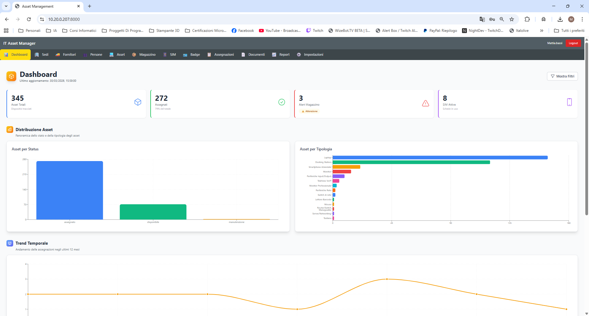
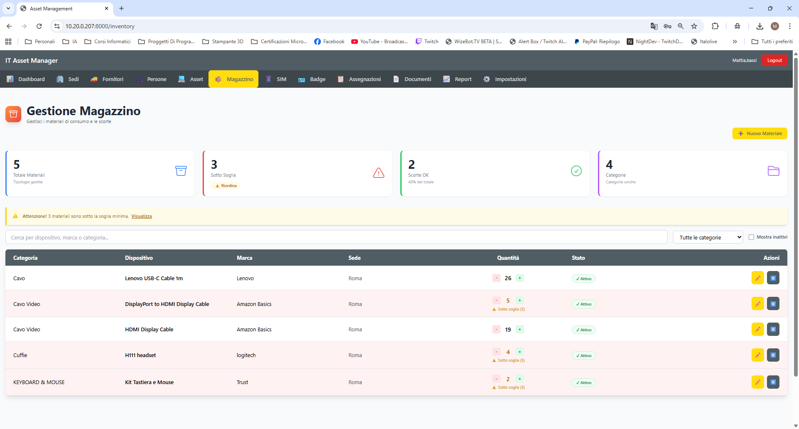
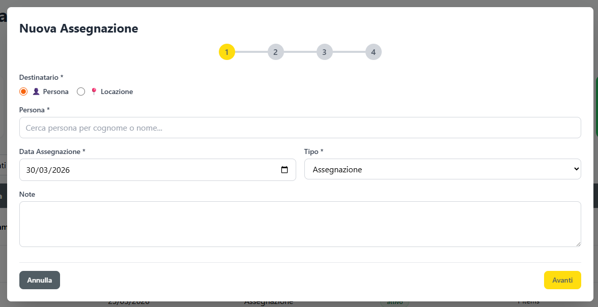
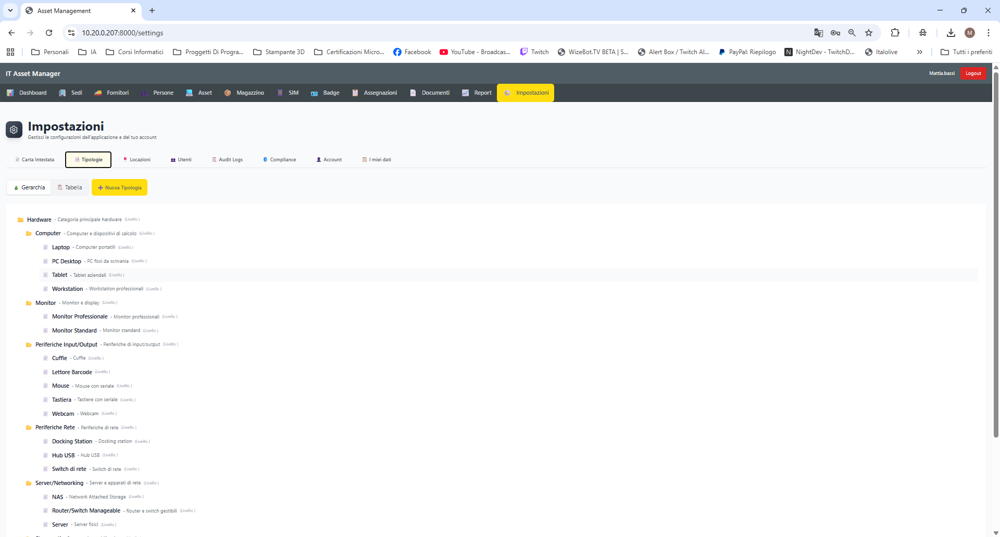
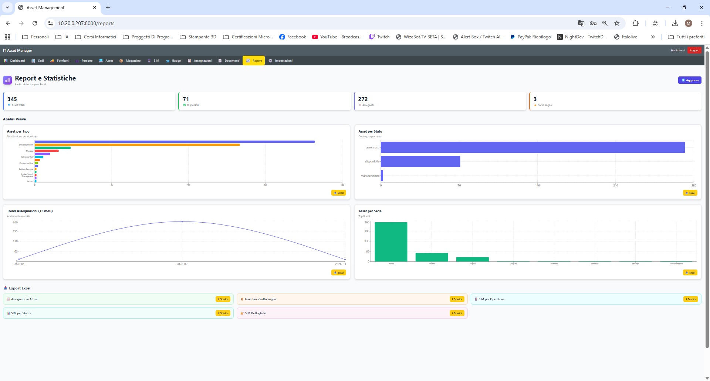
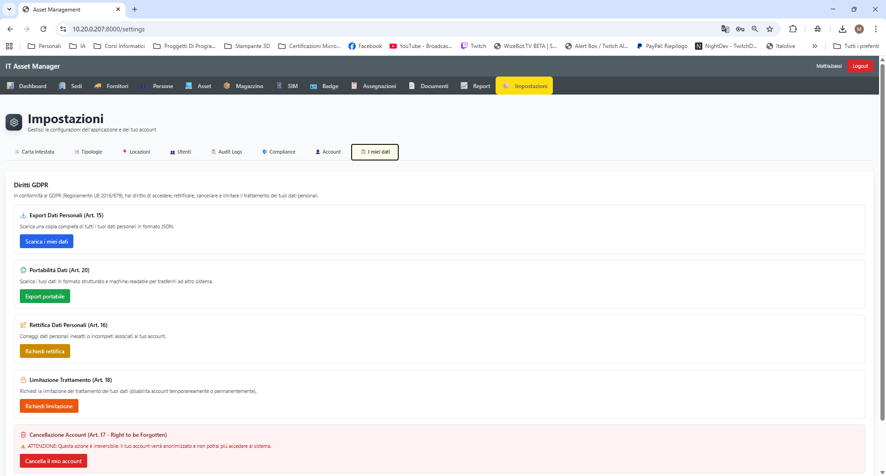
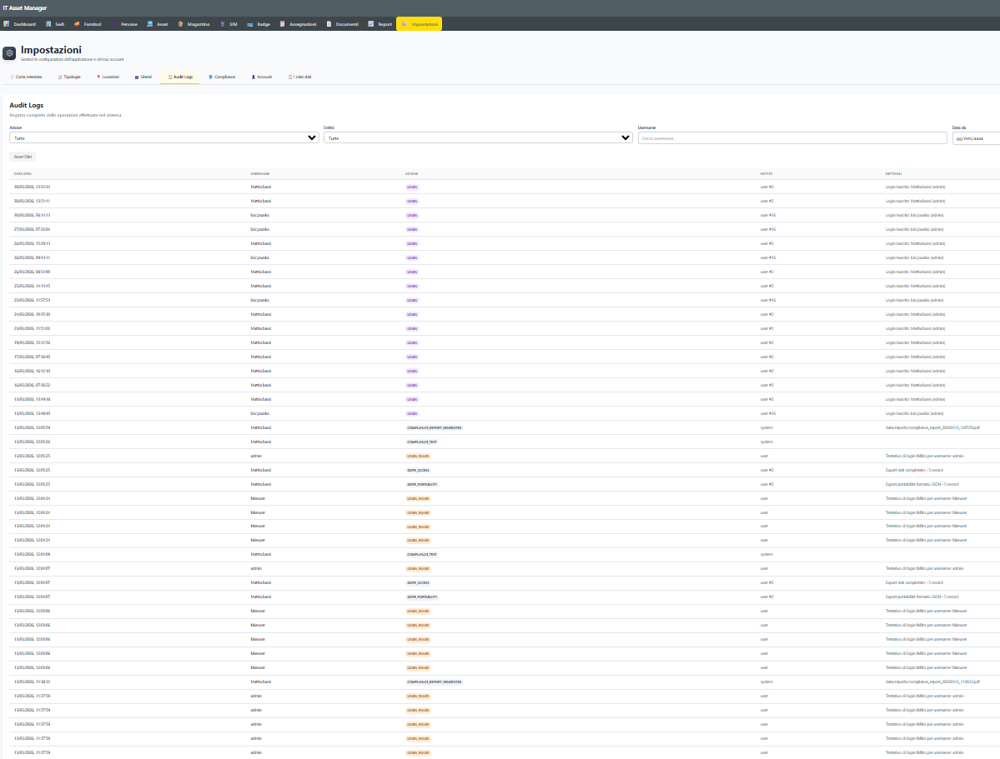

# IT Asset Manager

> **English** · [Italiano](#-panoramica)

---

## Overview

A self-hosted, production-grade web application for managing IT assets across an organization — with full **ISO 27001:2022** and **GDPR** compliance built in from day one.

Built solo in 68 days using an AI-augmented development workflow (Claude + Cursor). Every architectural decision, requirement, security control, and deployment detail was designed, validated, and owned by a single developer with 15+ years of IT infrastructure experience.

This is not a demo. It runs in production.

---

## Why I Built This

Most ITAM tools are either expensive SaaS products or outdated open-source projects that ignore modern security requirements. I needed something self-hosted, compliance-ready, and tailored to the realities of SMB IT infrastructure — so I built it.

The result is a system I'd confidently deploy in a healthcare or financial environment.

---

## Project Metrics

| Metric | Value |
|--------|-------|
| Development time | 68 days (solo) |
| Backend | ~10,000 lines Python |
| Frontend | ~8,500 lines TypeScript/TSX |
| Total code | ~18,500 lines |
| REST API endpoints | 125+ |
| Database tables | 17 |
| Compliance tests | 26/26 passed |
| Docker containers | 4 |
| Excel reports | 11 |
| Technical documents | 13 |

---

## Architecture

```
┌──────────────────────────────────────────────────────────────┐
│                        Local Network                         │
│                                                              │
│  ┌────────────────┐  ┌────────────────┐  ┌───────────────┐  │
│  │   asset-app    │  │ asset-mariadb  │  │  asset-redis  │  │
│  │                │  │                │  │               │  │
│  │  FastAPI +     │  │  MariaDB 10.11 │  │  Redis 7      │  │
│  │  React SPA     │──│  17 tables     │  │  Rate limit + │  │
│  │  125+ endpoints│  │  utf8mb4       │  │  Sessions     │  │
│  │                │  │                │  │               │  │
│  │  Port 8000     │  │  Port 3306     │  │  Port 6379    │  │
│  └────────────────┘  └────────────────┘  └───────────────┘  │
│                                                              │
│  ┌────────────────┐                                          │
│  │  compliance    │  Independent auditor container           │
│  │  26 tests      │  ISO 27001 Clause 9.2 separation         │
│  │  JSON + PDF    │  Runs on demand                          │
│  └────────────────┘                                          │
│                                                              │
│  ┌────────────────┐                                          │
│  │  setup-wizard  │  First-run only (Flask)                  │
│  │  8 screens     │  Auto-removes after install              │
│  │  Port 8080     │                                          │
│  └────────────────┘                                          │
└──────────────────────────────────────────────────────────────┘
```

### Request Flow

```
Browser → HTTPS → FastAPI (uvicorn)
                      │
                      ├── Security Headers Middleware (7 OWASP headers)
                      ├── CORS Middleware
                      ├── JWT Authentication
                      ├── Rate Limiting (slowapi + Redis)
                      ├── Router Layer — Pydantic validation
                      ├── Service Layer — Business logic + Audit logging
                      └── Data Layer — SQLAlchemy → MariaDB
```

---

## Tech Stack

### Backend
| Component | Technology |
|-----------|------------|
| Framework | Python 3.12 + FastAPI |
| ORM | SQLAlchemy 2.0 + Alembic |
| Validation | Pydantic v2 |
| Auth | JWT HS256 (python-jose), 8h expiry |
| Password | Argon2id (OWASP recommended) |
| Encryption | Fernet AES-128-CBC |
| Rate Limiting | slowapi + Redis |
| Server | uvicorn (ASGI, HTTPS/TLS) |

### Frontend
| Component | Technology |
|-----------|------------|
| Framework | React 19 + TypeScript |
| Styling | TailwindCSS 3 |
| Charts | Recharts |
| HTTP Client | Axios |
| Routing | React Router v6 |
| Build | Vite |

### Infrastructure
| Component | Technology |
|-----------|------------|
| Database | MariaDB 10.11 |
| Cache | Redis 7 Alpine |
| Containers | Docker + Docker Compose |
| Networking | macvlan (dedicated LAN IPs) |
| SSL | Auto-generated self-signed certificates |

---

## Features

- **Asset Management** — Full lifecycle tracking: laptops, monitors, phones, servers, peripherals
- **Assignment Workflow** — 4 types: new, renewal, substitution, return — with automatic PDF generation
- **Location Assignment** — Assets can be assigned to physical rooms, not just people
- **People & Sites** — Multi-site employee directory with hierarchical location management
- **SIM Cards** — Corporate SIM tracking with encrypted PIN/PUK (Fernet AES)
- **Inventory** — Consumables with automatic low-stock alerts
- **Suppliers** — Vendor registry with soft delete and audit trail
- **Document Attachments** — Upload manuals, warranties, contracts per asset
- **RBAC** — 3 roles (Admin, Operator, User) with automatic backend filtering for User role
- **Dashboard** — Real-time stats with Recharts visualizations, role-aware
- **Excel Reports** — 11 reports with charts and analytics dashboard
- **Audit Log** — Every CRUD operation logged, encrypted at rest, with rotation
- **GDPR Endpoints** — 6 data subject rights implemented (Art. 15–21)
- **Compliance Container** — 26 automated ISO 27001 tests, independent auditor architecture
- **Setup Wizard** — Guided first-run installation (8 screens, subnet scan, auto-generates config)

---

## Screenshots

| | |
|---|---|
|  |  |
| **Dashboard** — Real-time KPIs and asset distribution charts | **Inventory** — Low-stock alerts and consumable tracking |
|  |  |
| **Assignment Wizard** — 4-step workflow, person or location toggle | **Asset Types** — 3-level hierarchical category management |
|  |  |
| **Reports** — Analytics dashboard with 4 chart types + Excel export | **GDPR** — Data subject rights Art. 15–18 implemented |
|  | |
| **Audit Logs** — Full encrypted activity trail, live in production | |

---

## Security & Compliance

### Test Results

```
HTTP  (dev):   25/26  ✓  (HTTPS test expected fail)
HTTPS (prod):  26/26  ✓  All controls passed
```

### Security Implementation

| Control | Implementation | Standard |
|---------|----------------|----------|
| HTTPS/TLS | Self-signed RSA-2048, uvicorn SSL | ISO 27001 A.8.24 |
| Encryption at rest | Fernet AES-128-CBC (audit logs + SIM PIN/PUK) | ISO 27001 A.8.24 |
| Password hashing | Argon2id + pbkdf2_sha256 fallback | OWASP |
| Password policy | Minimum 12 characters (env configurable) | ISO 27001 |
| JWT | HS256, 8h expiry, 64-byte secret | — |
| Security headers | 7 OWASP headers (CSP, HSTS, X-Frame-Options…) | ISO 27001 A.8.9 |
| Rate limiting | 5 login attempts/min per IP (Redis-backed) | ISO 27001 A.8.16 |
| DB hardening | App user restricted to app container IP only | ISO 27001 A.8.20 |
| SQL injection | SQLAlchemy ORM only — zero raw queries | OWASP |
| Audit log | 17+ events, encrypted, with IP and user-agent | ISO 27001 A.12.4.1 |
| Log rotation | 24-month retention, Sunday 02:00 cron | ISO 27001 A.8.3 |
| Backup | Nightly mysqldump, 5-day retention | ISO 27001 A.8.3 |
| No generic accounts | No default `admin` — wizard creates named accounts only | ISO 27001 A.9 |

### Compliance Architecture (ISO 27001 Clause 9.2)

The audit container is fully independent — no access to the database, filesystem, or Docker socket. It communicates only via HTTP, exactly as an external auditor would.

```
┌─────────────────────┐   HTTP   ┌─────────────────────┐
│  asset-compliance   │ ──────▶  │     asset-app        │
│  (auditor)          │ ◀──────  │     (auditee)        │
│  26 tests           │          │                      │
│  JSON + PDF output  │          │                      │
└─────────────────────┘          └─────────────────────┘
         │
         ▼
   data/compliance/
   ├── latest_report.json
   └── compliance_report_*.pdf
```

---

## Installation

### Requirements

- Linux (Ubuntu 22.04+ or Debian 12+)
- Docker Engine 24.0+
- Docker Compose v2.20+

### Guided Setup (Wizard)

```bash
# 1. Clone the repository
git clone https://gitlab.com/mattia-bassi/it-asset-manager.git
cd it-asset-manager

# 2. Start the setup wizard
docker compose -f docker-compose.setup.yml build --no-cache
docker compose -f docker-compose.setup.yml up

# 3. Open your browser
#    http://<server-ip>:8080
#    Wizard credentials: setup / Setup@FirstRun!
```

The wizard handles everything in 8 screens: network detection (automatic subnet scan or manual IP input), database credentials, admin account creation, and automatic service startup. It generates `docker-compose.yml` and `.env` from your input, then removes itself.

See [INSTALLATION.md](INSTALLATION.md) for the full guide.

### Daily Operations

```bash
# Start
docker compose up -d

# Stop
docker compose down

# Logs
docker logs --tail 50 asset-app

# Run compliance audit
docker compose run --rm compliance
```

---

## Project Structure

```
it-asset-manager/
├── backend/                  # FastAPI application
│   ├── app/
│   │   ├── core/             # Config, security, encryption, rate limiting
│   │   ├── models/           # SQLAlchemy ORM models (17 tables)
│   │   ├── schemas/          # Pydantic v2 request/response schemas
│   │   ├── services/         # Business logic layer
│   │   ├── routers/          # API endpoints (125+)
│   │   └── middleware/       # OWASP security headers
│   ├── alembic/              # Database migrations
│   ├── entrypoint.sh         # Boot script (SSL detect + Alembic)
│   └── Dockerfile
├── frontend/                 # React 19 + TypeScript SPA
│   └── src/
│       ├── pages/            # 14 application pages
│       └── components/       # Reusable UI components
├── wizard/                   # First-run setup wizard (Flask)
│   ├── app.py                # 22-step installation API
│   └── templates/            # 8-screen wizard UI
├── compliance/               # Independent audit container
│   └── compliance_test.py    # 26 ISO 27001 + GDPR tests
├── docs/                     # Full technical documentation
├── docker-compose.setup.yml
├── INSTALLATION.md
└── LICENSE
```

---

## Documentation

| Document | Description |
|----------|-------------|
| [INSTALLATION.md](INSTALLATION.md) | Complete setup and configuration guide |
| [ARCHITECTURE.md](docs/ARCHITECTURE.md) | System architecture, request flow, networking |
| [API_REFERENCE.md](docs/API_REFERENCE.md) | All 125+ endpoints with examples |
| [DATABASE_SCHEMA.md](docs/DATABASE_SCHEMA.md) | 17 tables, relationships, foreign keys |
| [COMPLIANCE.md](docs/COMPLIANCE.md) | 26 compliance controls, GDPR implementation |
| [CHANGELOG.md](docs/CHANGELOG.md) | Full version history |

---

## License

Released under [CC BY-NC-ND 4.0](LICENSE).  
Personal use and sharing permitted. Commercial use, resale, and modified distributions are not allowed.

---

## Author

**Mattia Bassi** — IT Systems Architect & AI-Augmented Full Stack Developer

15+ years managing IT infrastructure in enterprise and healthcare environments. In 2026 I developed a structured human-AI collaboration method that allowed me to design, build, and ship this complete enterprise application solo — handling every phase from requirements and architecture to deployment and compliance documentation.

This project is the concrete proof of that method.

[LinkedIn](https://linkedin.com/in/mattia-bassi-3a976024)

---

# 🇮🇹 Panoramica

Un'applicazione web self-hosted e production-grade per la gestione del patrimonio IT aziendale — con conformità **ISO 27001:2022** e **GDPR** integrata dall'inizio.

Sviluppata in autonomia in 68 giorni con un workflow AI-augmented (Claude + Cursor). Ogni decisione architetturale, requisito, controllo di sicurezza e dettaglio di deployment è stato progettato, validato e gestito da un singolo sviluppatore con 15+ anni di esperienza in infrastrutture IT.

Non è una demo. Gira in produzione.

---

## Perché l'ho costruita

La maggior parte degli strumenti ITAM è costosa come SaaS o obsoleta come open source, e ignora i requisiti di sicurezza moderni. Avevo bisogno di qualcosa di self-hosted, compliance-ready e adatto alla realtà delle infrastrutture IT delle PMI — quindi l'ho costruito.

Il risultato è un sistema che potrei tranquillamente deployare in ambiente sanitario o finanziario.

---

## Metriche Progetto

| Metrica | Valore |
|---------|--------|
| Tempo di sviluppo | 68 giorni (solo) |
| Backend | ~10.000 righe Python |
| Frontend | ~8.500 righe TypeScript/TSX |
| Totale codice | ~18.500 righe |
| Endpoint REST | 125+ |
| Tabelle database | 17 |
| Test compliance | 26/26 superati |
| Container Docker | 4 |
| Report Excel | 11 |
| Documenti tecnici | 13 |

---

## Funzionalità Principali

- **Gestione Asset** — Tracciamento completo lifecycle: laptop, monitor, telefoni, server, periferiche
- **Workflow Assegnazioni** — 4 tipi: nuova, rinnovo, sostituzione, riconsegna — con PDF automatici
- **Assegnazioni a Locazione** — Asset assegnabili a sale fisiche, oltre che a persone
- **Persone e Sedi** — Anagrafica multi-sede con gestione gerarchica locazioni
- **SIM Aziendali** — PIN/PUK crittografati Fernet AES
- **Magazzino** — Consumabili con alert automatici scorte basse
- **Fornitori** — Anagrafica con soft delete e audit trail
- **Documenti** — Upload allegati per asset (manuali, garanzie, contratti)
- **RBAC** — 3 ruoli (Admin, Operatore, User) con filtri automatici backend
- **Dashboard** — Statistiche in tempo reale con Recharts, role-aware
- **Report Excel** — 11 report con grafici e dashboard analitica
- **Audit Log** — Ogni operazione CRUD loggata, cifrata at rest, con rotazione
- **Endpoint GDPR** — 6 diritti degli interessati implementati (Art. 15–21)
- **Container Compliance** — 26 test ISO 27001 automatici, architettura auditor indipendente
- **Wizard di Setup** — Installazione guidata (8 schermate, scan subnet, config autogenerata)

---

## Installazione

### Prerequisiti

- Linux (Ubuntu 22.04+ o Debian 12+)
- Docker Engine 24.0+
- Docker Compose v2.20+

### Installazione Guidata (Wizard)

```bash
# 1. Clona il repository
git clone https://gitlab.com/mattia-bassi/it-asset-manager.git
cd it-asset-manager

# 2. Avvia il wizard di configurazione
docker compose -f docker-compose.setup.yml build --no-cache
docker compose -f docker-compose.setup.yml up

# 3. Apri il browser
#    http://<ip-server>:8080
#    Credenziali wizard: setup / Setup@FirstRun!
```

Il wizard gestisce tutto in 8 schermate: rilevamento rete (scan automatico subnet o IP manuale), credenziali database, creazione account admin, avvio servizi. Genera `docker-compose.yml` e `.env` dall'input dell'utente, poi si auto-elimina.

Vedi [INSTALLATION.md](INSTALLATION.md) per la guida completa.

---

## Autore

**Mattia Bassi** — IT Systems Architect & AI-Augmented Full Stack Developer

15+ anni di gestione infrastrutture IT in ambienti enterprise e sanitari. Nel 2026 ho sviluppato un metodo strutturato di collaborazione uomo-AI che mi ha permesso di progettare, costruire e rilasciare in produzione questa applicazione enterprise in autonomia — gestendo ogni fase dai requisiti all'architettura, fino al deployment e alla documentazione compliance.

Questo progetto è la prova concreta di quel metodo.

[LinkedIn](https://linkedin.com/in/mattia-bassi-3a976024)

---

*Versione Documentazione: 1.0 — Marzo 2026*
